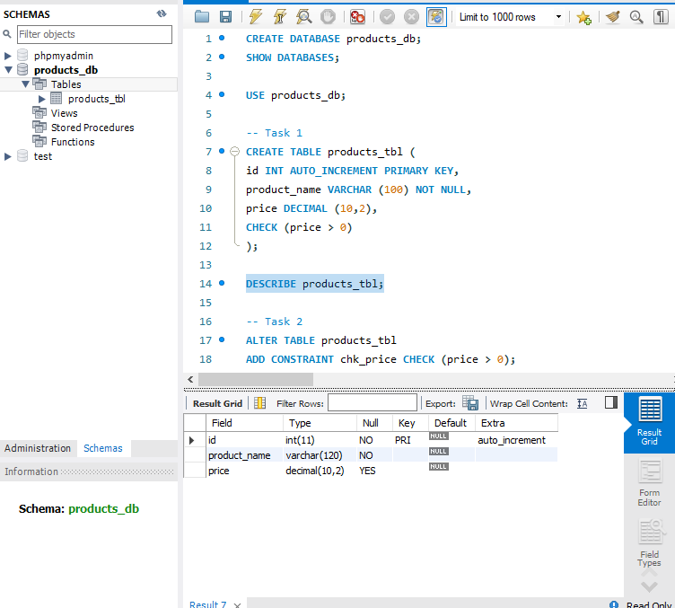
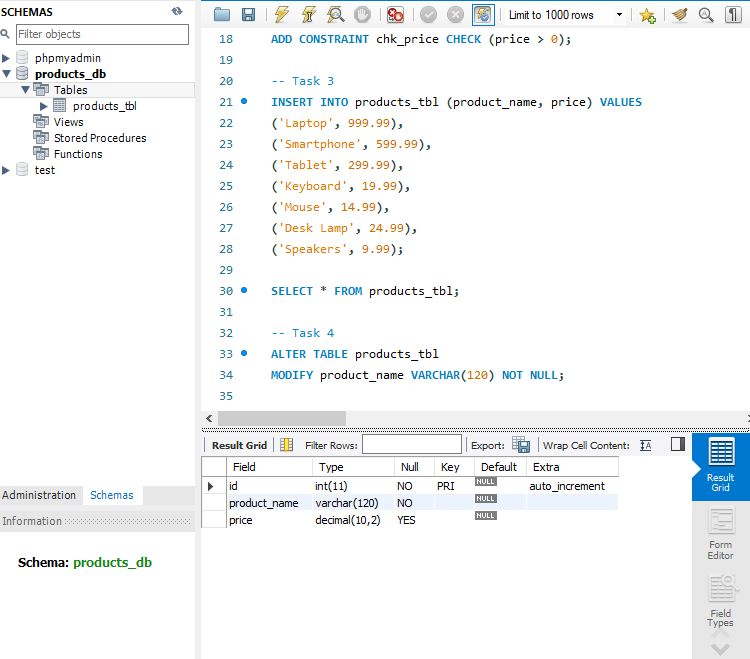
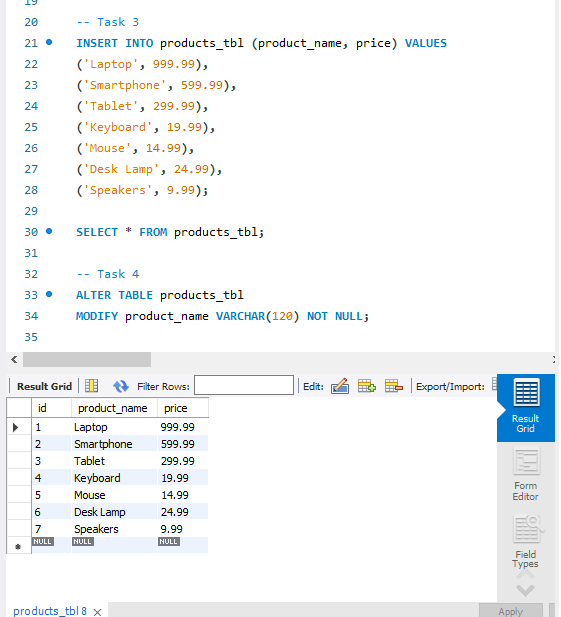
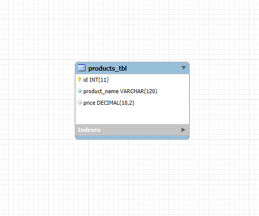

# Finals Lab Task 3. Table Manipulation
This task involves creating and managing a product database using MySQL. You are required to follow a step-by-step approach to perform operations such as table creation, data insertion, and schema modification.

## Here’s the Query Statements

Fisrt, a command that create a database, so subsequent SQL operations will be performed within that specific database.
```sql
CREATE DATABASE products_db;
SHOW DATABASES;

USE products_db;
```

### TASK 1
```sql
CREATE TABLE products_tbl (
id INT AUTO_INCREMENT PRIMARY KEY,
product_name VARCHAR (100) NOT NULL,
price DECIMAL (10,2),
CHECK (price > 0)
);

DESCRIBE products_tbl;
```
### TASK 2
```sql
ALTER TABLE products_tbl
ADD CONSTRAINT chk_price CHECK (price > 0);
```

### TASK 3
```sql
INSERT INTO products_tbl (product_name, price) VALUES
('Laptop', 999.99),
('Smartphone', 599.99),
('Tablet', 299.99),
('Keyboard', 19.99),
('Mouse', 14.99),
('Desk Lamp', 24.99),
('Speakers', 9.99);

SELECT * FROM products_tbl;
```

### TASK 4
```sql
ALTER TABLE products_tbl
MODIFY product_name VARCHAR(120) NOT NULL;
```
This command is used in MySQL Workbench to display the structure of the table, showing details about each column such as its name, data type, whether it allows NULL values, if it's a key, its default value, and any extra attributes.
```sql
DESCRIBE products_tbl;
```
Here's the screenshot of whole Query Statements (See screenshots)

 ### The Query Statements
 



Here's the screenshot of Table Structure (See screenshots)

### Product Table
  


Here's the ER Diagram or Relational Schema


