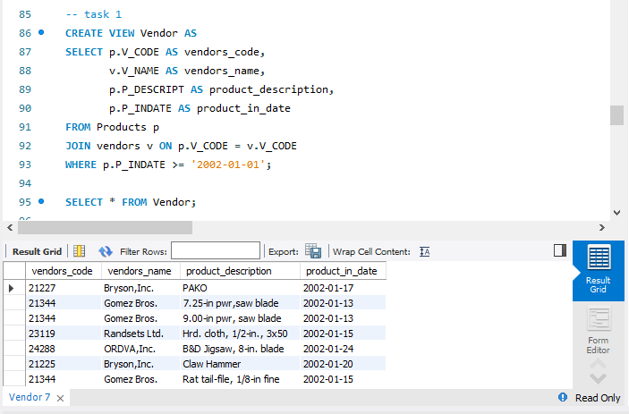
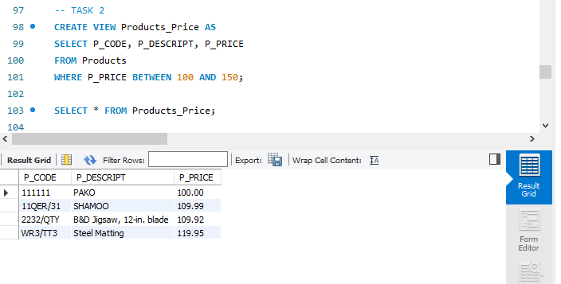
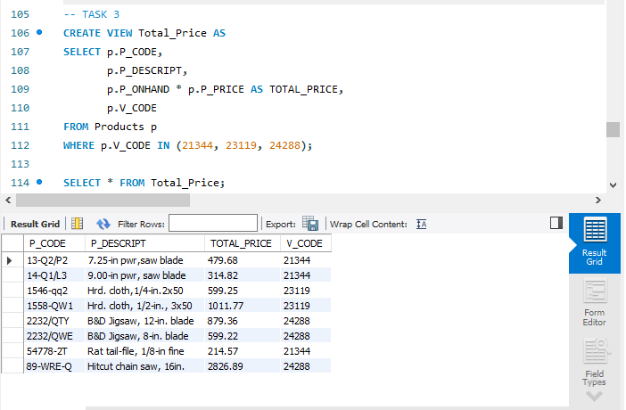
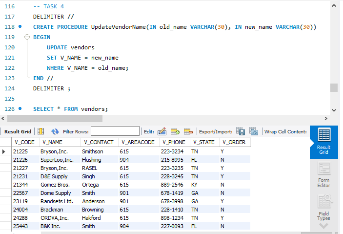
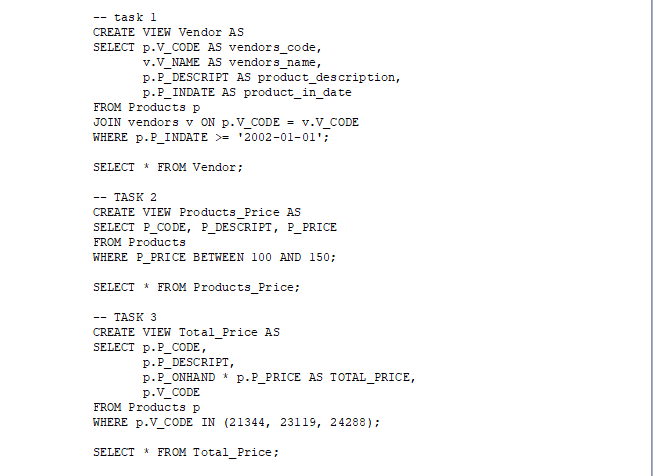
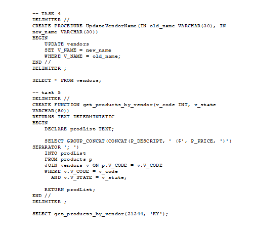

# Final Lab Task 5: Using SQL Views and Stored Procedures and Stored Functions
For this task, we are given initial query creates reusable views, procedures, and functions to simplify querying and updating product and vendor data in the inventory database.

## Here’s the Query Statements

### TASK 1
```sql
CREATE VIEW Vendor AS
SELECT p.V_CODE AS vendors_code, 
       v.V_NAME AS vendors_name, 
       p.P_DESCRIPT AS product_description, 
       p.P_INDATE AS product_in_date
FROM Products p
JOIN vendors v ON p.V_CODE = v.V_CODE
WHERE p.P_INDATE >= '2002-01-01';

SELECT * FROM Vendor;
```

### TASK 2
```sql
CREATE VIEW Products_Price AS
SELECT P_CODE, P_DESCRIPT, P_PRICE
FROM Products
WHERE P_PRICE BETWEEN 100 AND 150;

SELECT * FROM Products_Price;
```

### TASK 3
```sql
CREATE VIEW Total_Price AS
SELECT p.P_CODE, 
       p.P_DESCRIPT, 
       p.P_ONHAND * p.P_PRICE AS TOTAL_PRICE, 
       p.V_CODE
FROM Products p
WHERE p.V_CODE IN (21344, 23119, 24288);

SELECT * FROM Total_Price;
```

### TASK 4
```sql
DELIMITER //
CREATE PROCEDURE UpdateVendorName(IN old_name VARCHAR(30), IN new_name VARCHAR(30))
BEGIN
    UPDATE vendors
    SET V_NAME = new_name
    WHERE V_NAME = old_name;
END //
DELIMITER ;

SELECT * FROM vendors;
```

### TASK 5
```sql
DELIMITER // 
CREATE FUNCTION get_products_by_vendor(v_code INT, v_state VARCHAR(50))
RETURNS TEXT DETERMINISTIC
BEGIN
    DECLARE prodList TEXT;
    
    SELECT GROUP_CONCAT(CONCAT(P_DESCRIPT, ' ($', P_PRICE, ')') SEPARATOR '; ')
    INTO prodList
    FROM products p
    JOIN vendors v ON p.V_CODE = v.V_CODE
    WHERE v.V_CODE = v_code
      AND v.V_STATE = v_state;
	
    RETURN prodList;
END //
DELIMITER ;
```

### It is how to run the function after creating it.
```sql
SELECT get_products_by_vendor(21344, 'KY');
```

## Here's the screenshot of the whole Query Statements and Table Structure (See screenshots)

### TASK 1



### TASK 2



### TASK 3



### TASK 4



### TASK 5

.png)
.png)

### Sql copy of the database and table structures



