# Final Lab Task 6: MongoDB Practice
For this task, we are given initial query in order to used and develop hands-on skills in managing and querying data using MongoDB.

## Here’s the Query Statements

First, select the database you want to work with in MongoDB.
```sql
use mongo_practice
```
### Create Database

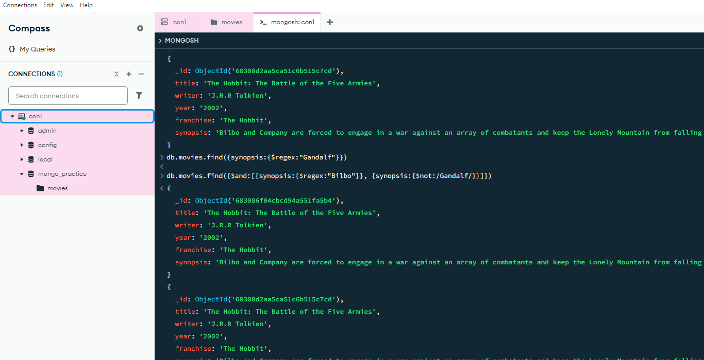

### Insert Documents

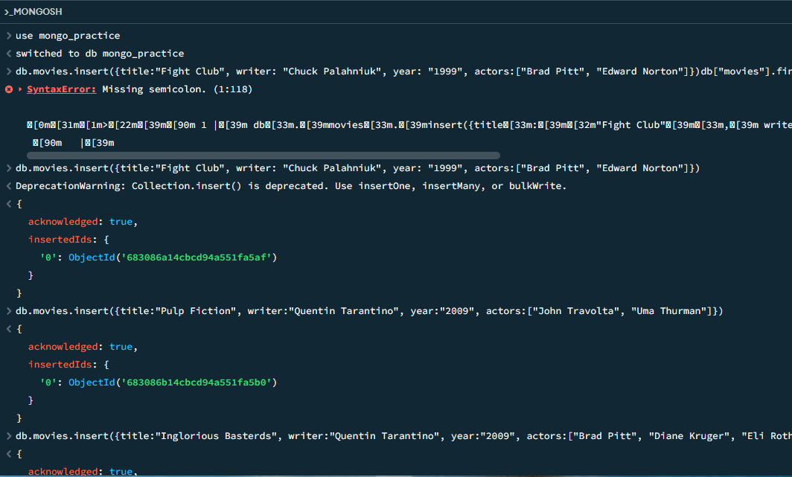

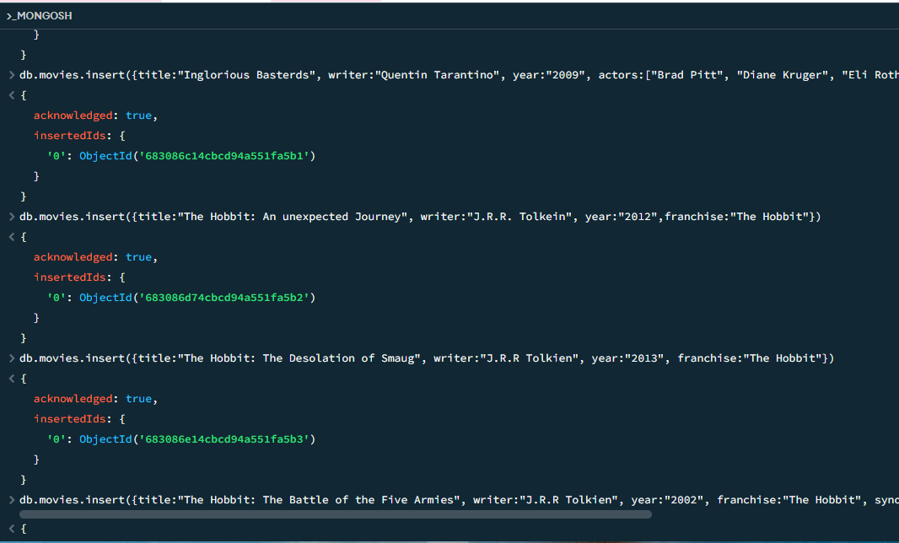

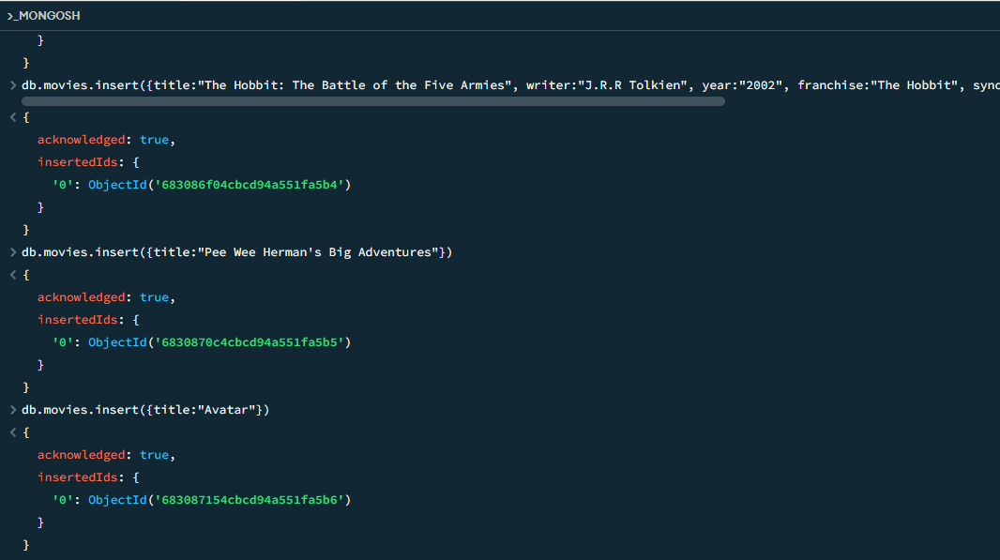

### Query Find
```sql
db.movies.find()
```
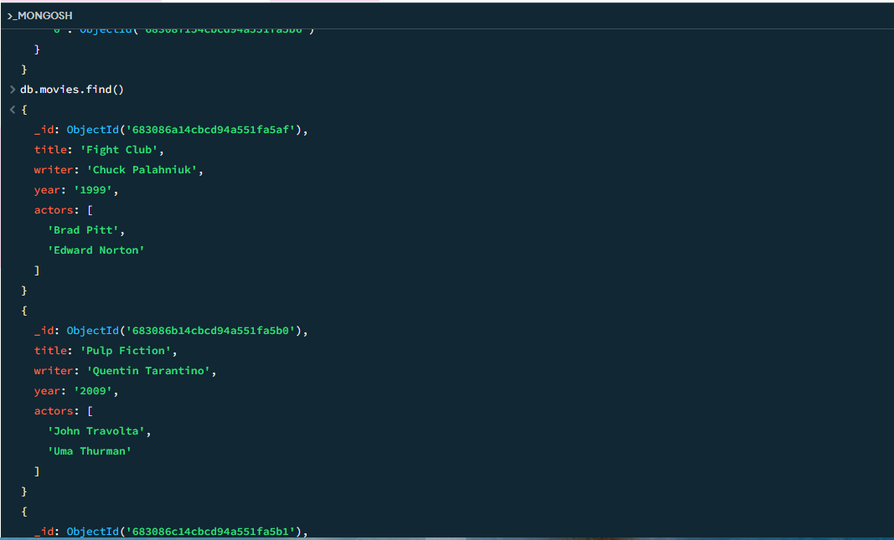

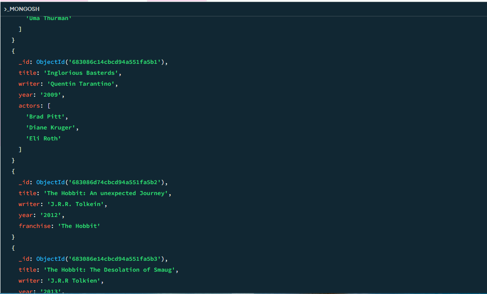

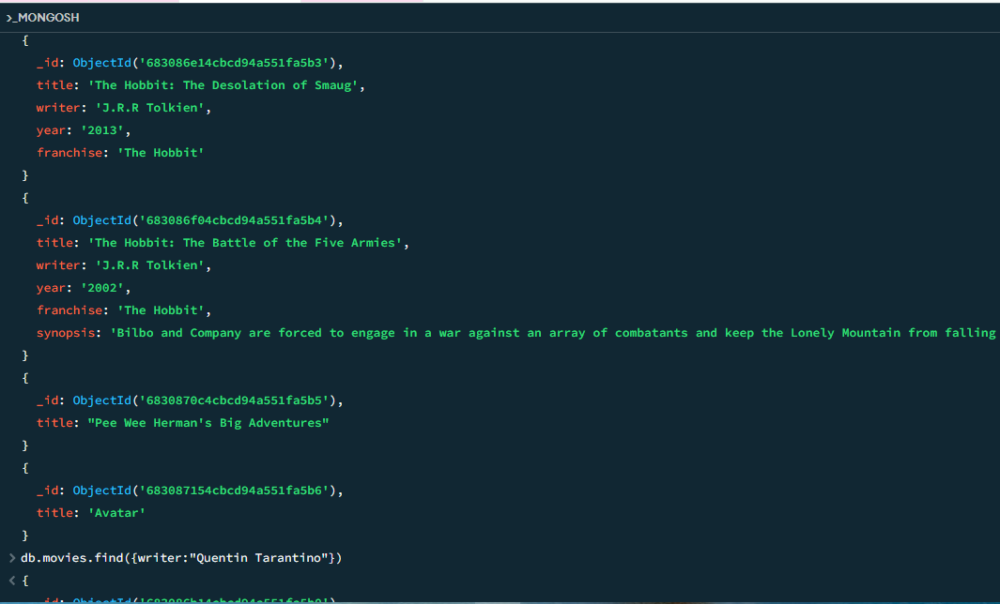

```sql
db.movies.find({writer:”Quentin Tarantino”})
```
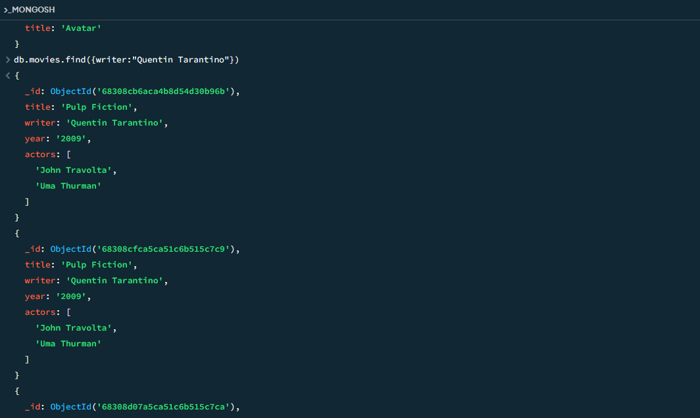

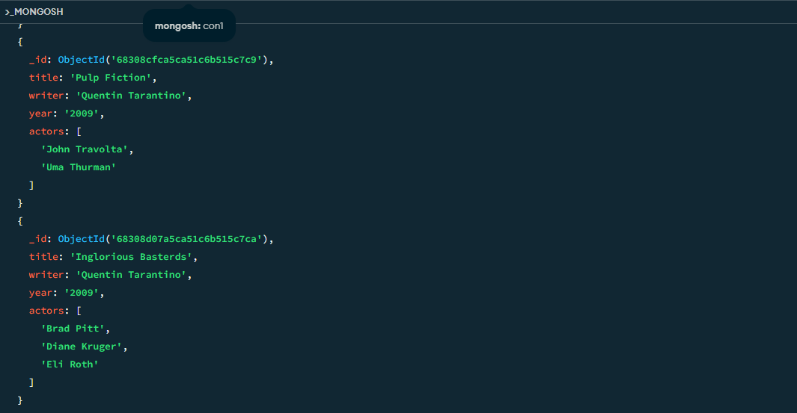

```sql
db.movies.find({actors:”Brad Pitt”})
```
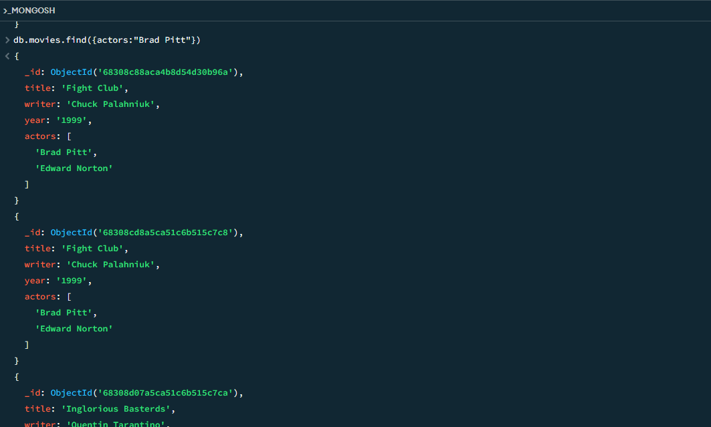


```sql
db.movies.find({franchise:”The Hobbit”})
```
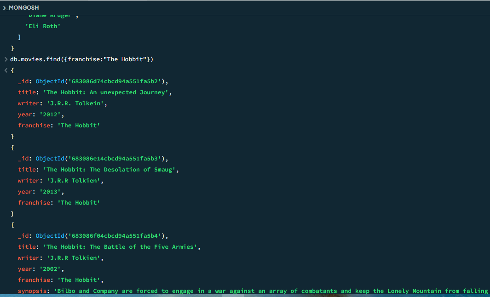

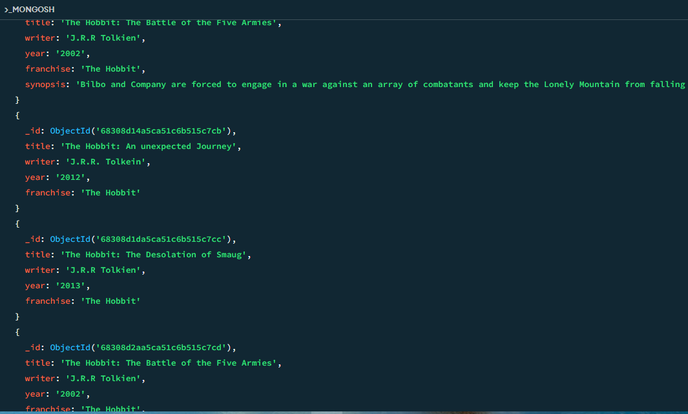

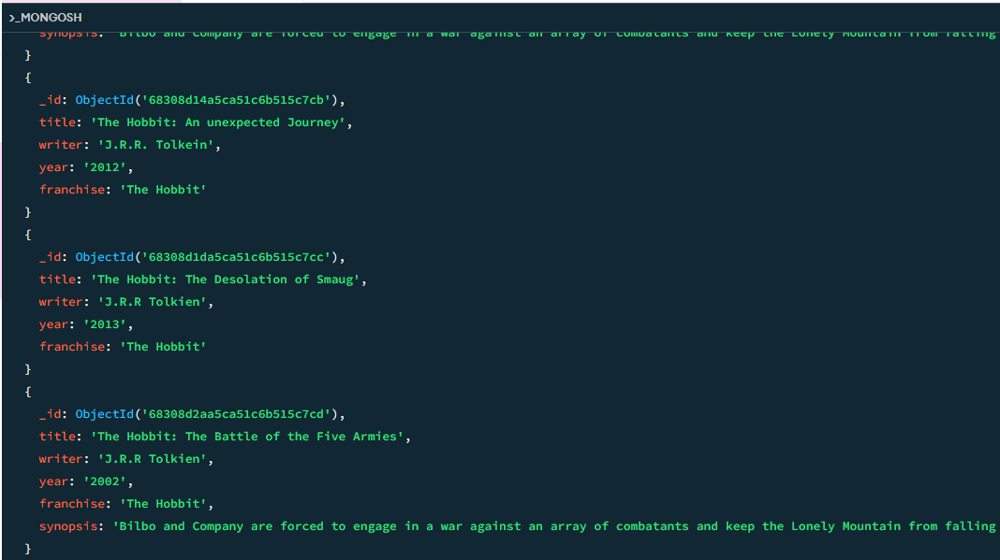

```sql
db.movies.find({year:{$gt:”1990”, $lt:”2000”}})
```
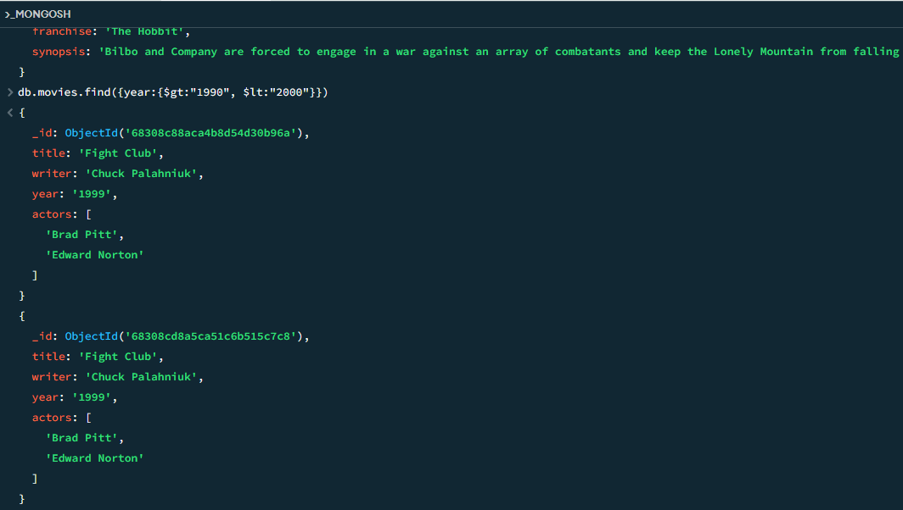

```sql
db.movies.find({$or:[{year:{$gt:”2010”}},{year: {$lt:”2000”}}]})
```
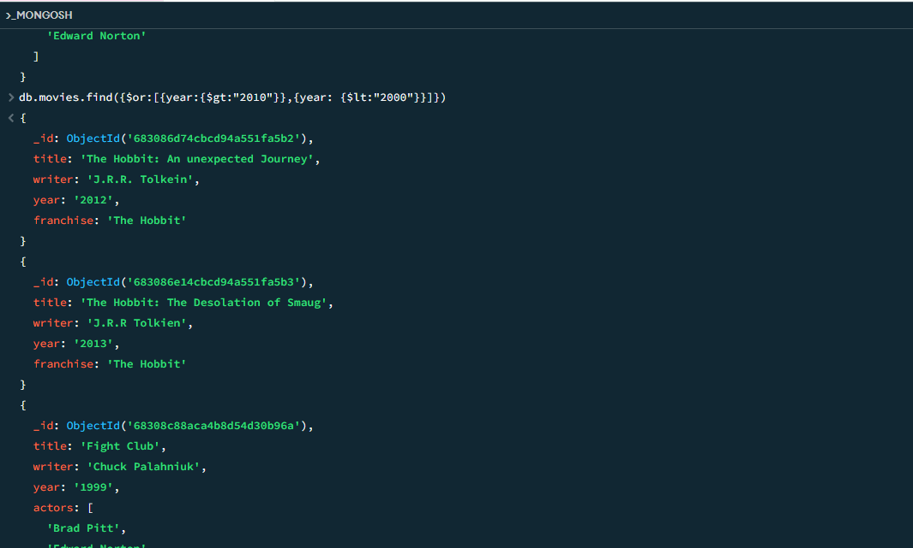

.png)

.png)

### Update Documents

```sql
db.movies.update({_id:ObjectId("5c9f98e5e5c2dfe9b3729bfe")}, {$set:{synopsis:"A reluctant hobbit, Bilbo Baggins, sets out to the Lonely Mountain with a spirited group of dwarves to reclaim their mountain home - and the gold within it - from the dragon Smaug."}})
```
```sql
db.movies.update({_id:ObjectId("5c9fa42ae5c2dfe9b3729c03")}, {$set:{synopsis:"The dwarves, along with Bilbo Baggins and Gandalf the Grey, continue their quest to reclaim Erebor, their homeland, from Smaug. Bilbo Baggins is in possession of a mysterious and magical ring."}})
```
```sql
db.movies.update({_id:ObjectId("5c9f983ce5c2dfe9b3729bfc")}, {$push:{actors:"Samuel L. Jackson"}})
```
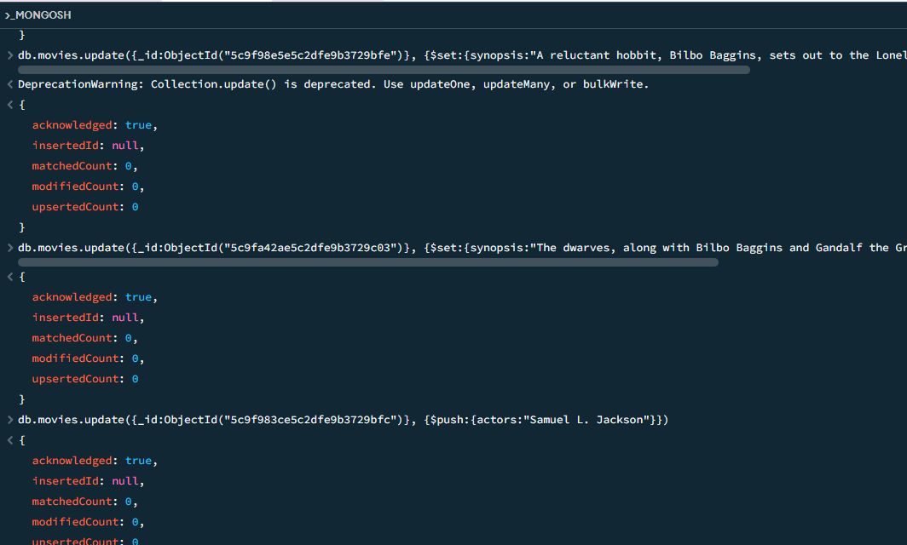

### Text Search

```sql
db.movies.find({synopsis:{$regex:"Bilbo"}})
```
```sql
db.movies.find({synopsis:{$regex:"Gandalf"}})
```
```sql
db.movies.find({$and:[{synopsis:{$regex:"Bilbo"}}, {synopsis:{$not:/Gandalf/}}]})
```
```sql
db.movies.find({$or:[{synopsis:{$regex:"dwarves"}}, {synopsis:{$regex:"hobbit"}}]})
```
```sql
db.movies.find({$and:[{synopsis:{$regex:"gold"}}, {synopsis:{$regex:"dragon"}}]})
```
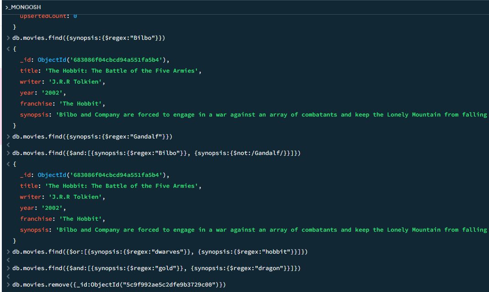

### Delete Documents

```sql
db.movies.remove({_id:ObjectId("5c9f992ae5c2dfe9b3729c00")})
```
```sql
db.movies.remove({_id:ObjectId("5c9f9936e5c2dfe9b3729c01")})
```
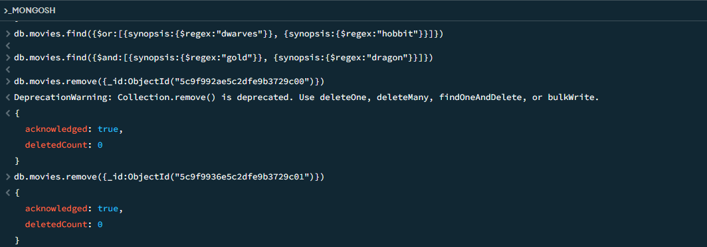

